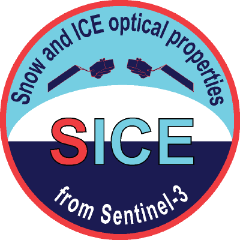

<a href="https://github.com/GEUS-SICE/pySICE" target="_blank" style="display: inline-flex; align-items: center; gap: 8px;">
  
  <strong>https://github.com/GEUS-SICE/pySICE</strong>
</a>

   

pySICE retrieves snow surface properties such as grain size, albedo, and impurity content from Sentinel-3 OLCI reflectances using a physically based radiative transfer approach.

Developed by B. Vandecrux (GEUS), A. Kokhanovsky (GFZ), and J. Box (GEUS).  

