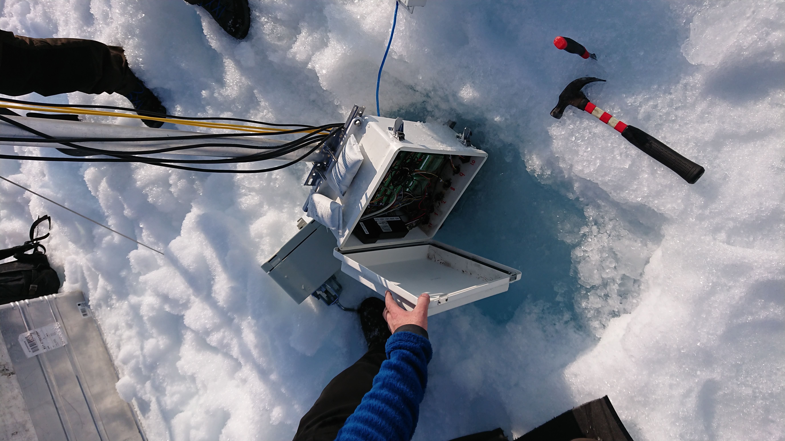
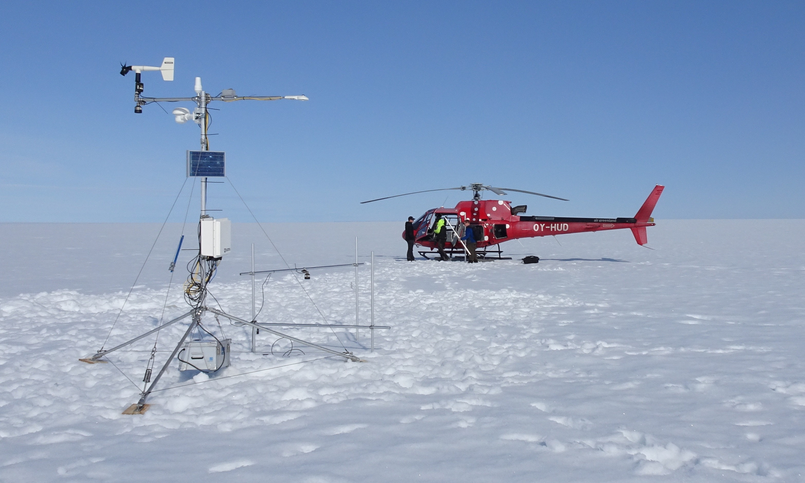

With this fieldwork, I visited some of the most remote places in Greenland: the Kronprins Christian Land, Centrum Sø and the two lonely weather stations of KPC_L and KPC_U.

KPC_U was slowly getting frozen into the ice sheet: every summer, more ice refeezes on top of previous years' ice. This is an accumulation process called superimposed ice formation.

After our visit the new KPC_U station looked in better shape.

