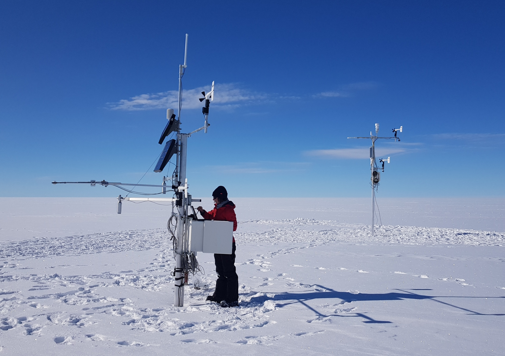
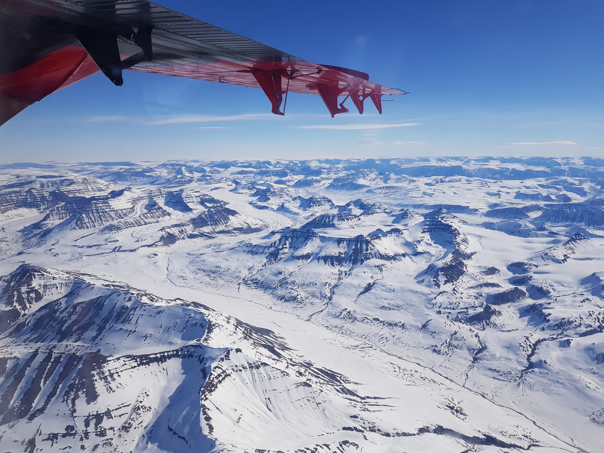

In Southern Greenland, we visited KAN_U, DYE-2, Saddle, NASA-SE, South Dome, Crawford Point. Then we moved North and were stationed in Qaanaaq. From there we visited Camp Century, Humboldt and NEEM.

Some of the locations visited still had the weather stations installed by Pr. Konrad Steffen, pioneer and founder of the GC-Net project in 1995. The GEUS weather station was installed next to the historical station and both stations collected weather obervations simulatenously before the historical station was taken down.

Snow pit and fir core studies were conducted at every site, measuring the snow and firn stratigraphy and density.

(Photo: Ken Mankoff)

The jaw-dropping landscapes of northwestern Greenland.

