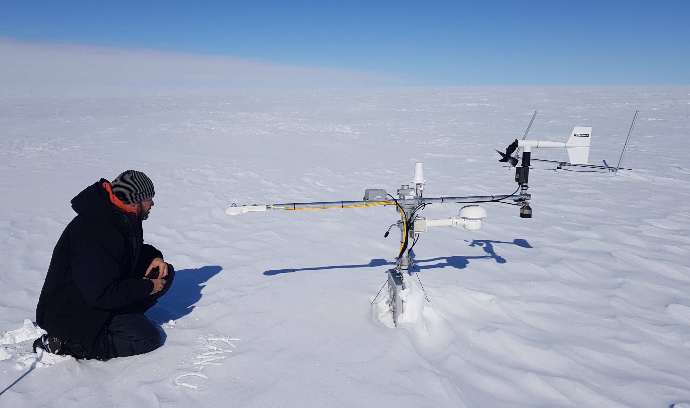

Weather station maintenance in South Greenland. We visited KAN_U, DYE-2, South Dome, Saddle, NASA-SE and Crawford Point.
As the worried look on Andreas' face indicates, KAN_U was standing in rather poor shape and almost buried in snow when we arrived. Maintenance was most needed!

Each year the stations' masts are extended to prevent the instruments or the logger box to get buried in the accumulating snow. Andreas and Jacob check that the DYE-2 station work as it should before leaving.

