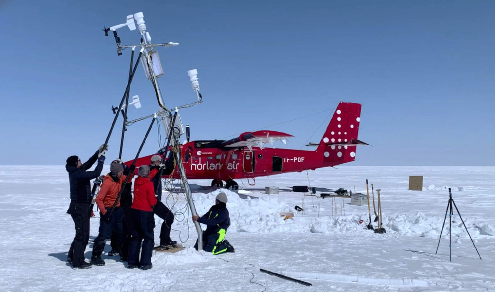

I'm a researcher focused on the interaction between the **Greenland ice sheet** and **climate change**. My work combines **in situ observations**, **remote sensing**, and **machine learning** to improve our understanding of the ice sheet **surface mass and energy balance**.

Through extensive **fieldwork**, I've gained a hands-on understanding of the physical processes transforming the ice. We're entering a new era where **ice sheet data** are more abundant than ever—offering powerful opportunities for model refinement and deeper insights.

I want to help build a research community that is **open, transparent, and collaborative**, and that actively **makes space for diverse voices and contributions**.

